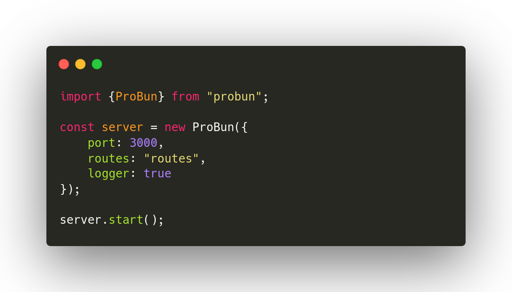

# ProBun Example Project v0.1.1

GET, POST, PUT, DELETE and PATCH requests are supported. View how to use them in routes/methods.ts.

## Stupidly easy.

## Get Started

1. Clone the repo: `git clone https://github.com/benjamint08/probun-example.git`
2. Install dependencies via bun install: `bun install`
3. Run the server! `bun run .`

Don't forget to check out the official [ProBun Docs](https://probun.p3pr.co)
